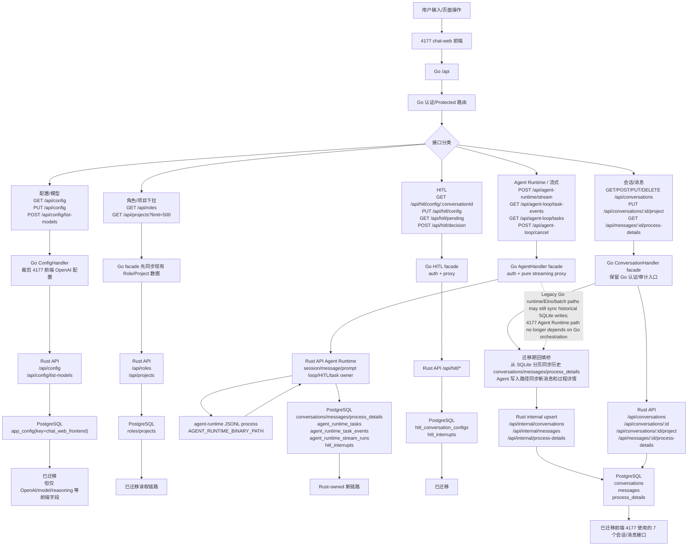

# API Migration Flow

Status checked on 2026-06-27.

```mermaid
flowchart TD
  U["用户输入/页面操作"] --> FE["4177 chat-web 前端"]
  FE --> API["Go /api"]
  API --> AUTH["Go 认证/Protected 路由"]
  AUTH --> KIND{"接口分类"}

  KIND --> CFG["配置/模型\nGET /api/config\nPUT /api/config\nPOST /api/config/list-models"]
  CFG --> CFG_GO["Go ConfigHandler\n裁剪 4177 前端 OpenAI 配置"]
  CFG_GO --> CFG_RUST["Rust API\n/api/config\n/api/config/list-models"]
  CFG_RUST --> CFG_PG["PostgreSQL\napp_config(key=chat_web_frontend)"]
  CFG_PG --> CFG_OK["已迁移\n但仅 OpenAI/model/reasoning 等前端字段"]

  KIND --> RP["角色/项目下拉\nGET /api/roles\nGET /api/projects?limit=500"]
  RP --> RP_SYNC["Go facade 先同步现有 Role/Project 数据"]
  RP_SYNC --> RP_RUST["Rust API\n/api/roles\n/api/projects"]
  RP_RUST --> RP_PG["PostgreSQL\nroles/projects"]
  RP_PG --> RP_OK["已迁移读取链路"]

  KIND --> RT["Agent Runtime / 流式\nPOST /api/agent-runtime/stream\nGET /api/agent-loop/task-events\nGET /api/agent-loop/tasks\nPOST /api/agent-loop/cancel"]
  RT --> RT_GO["Go AgentHandler facade\nauth + pure streaming proxy"]
  RT_GO --> RT_RUST["Rust API Agent Runtime\nsession/message/prompt loop/HITL/task owner"]
  RT_RUST --> RT_BIN["agent-runtime JSONL process\nAGENT_RUNTIME_BINARY_PATH"]
  RT_RUST --> RT_PG["PostgreSQL\nconversations/messages/process_details\nagent_runtime_tasks\nagent_runtime_task_events\nagent_runtime_stream_runs\nhitl_interrupts"]
  RT_BIN --> RT_RUST
  RT_PG --> RT_OK["Rust-owned 新链路"]

  KIND --> HITL["HITL\nGET /api/hitl/config/:conversationId\nPUT /api/hitl/config\nGET /api/hitl/pending\nPOST /api/hitl/decision"]
  HITL --> HITL_GO["Go HITL facade\nauth + proxy"]
  HITL_GO --> HITL_RUST["Rust API /api/hitl/*"]
  HITL_RUST --> HITL_PG["PostgreSQL\nhitl_conversation_configs\nhitl_interrupts"]
  HITL_PG --> HITL_OK["已迁移"]

  KIND --> CONV["会话/消息\nGET/POST/PUT/DELETE /api/conversations\nPUT /api/conversations/:id/project\nGET /api/messages/:id/process-details"]
  CONV --> CONV_GO["Go ConversationHandler facade\n保留 Go 认证/审计入口"]
  CONV_GO --> CONV_SYNC["迁移期回填桥\n从 SQLite 分页同步历史 conversations/messages/process_details\nAgent 写入路径同步新消息和过程详情"]
  CONV_SYNC --> CONV_INTERNAL["Rust internal upsert\n/api/internal/conversations\n/api/internal/messages\n/api/internal/process-details"]
  CONV_GO --> CONV_RUST["Rust API\n/api/conversations\n/api/conversations/:id\n/api/conversations/:id/project\n/api/messages/:id/process-details"]
  CONV_INTERNAL --> CONV_PG["PostgreSQL\nconversations\nmessages\nprocess_details"]
  CONV_RUST --> CONV_PG
  CONV_PG --> CONV_OK["已迁移前端 4177 使用的 7 个会话/消息接口"]

  RT_GO -. "Legacy Go runtime/Eino/batch paths may still sync historical SQLite writes;\n4177 Agent Runtime path no longer depends on Go orchestration" .-> CONV_SYNC
```
